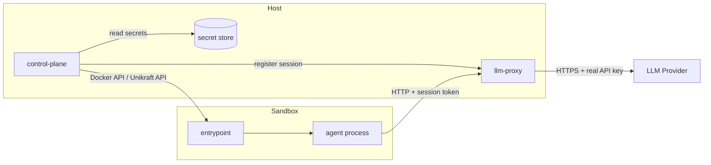
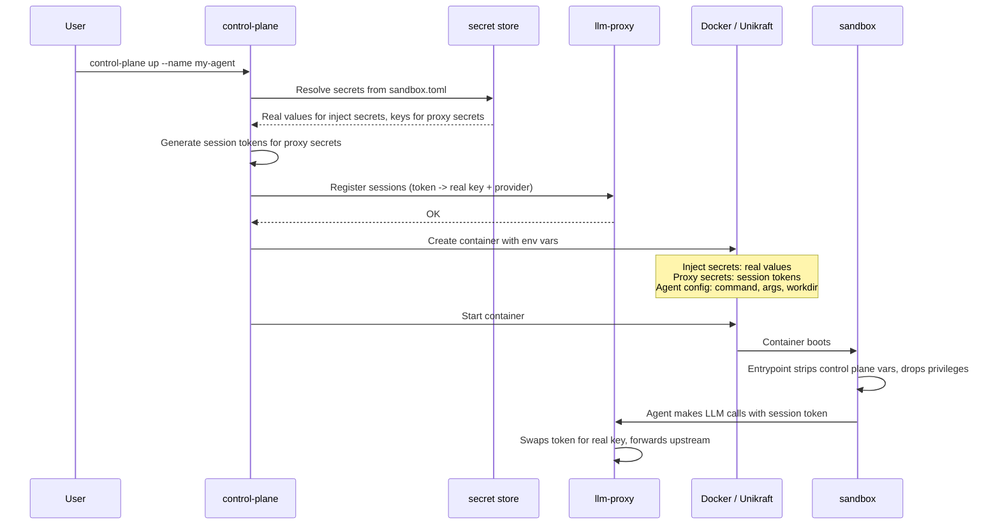
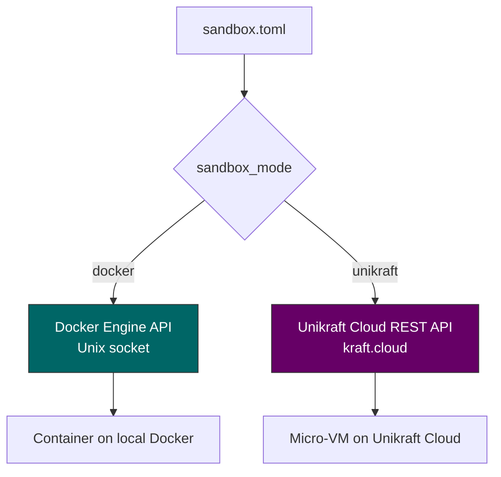

# control-plane

The orchestrator for the agent sandbox system. Reads a `sandbox.toml` config, manages an encrypted secret store, provisions sandboxes (Docker or Unikraft), and coordinates the [llm-proxy](https://github.com/Travbz/llm-proxy) for credential proxying. One command to boot an isolated agent environment with the hybrid credential model.

Part of a three-service system:

| Repo | What it does |
|---|---|
| **[control-plane](https://github.com/Travbz/control-plane)** | This repo -- orchestrator, config, secrets, provisioning |
| **[llm-proxy](https://github.com/Travbz/llm-proxy)** | Credential-injecting LLM reverse proxy |
| **[sandbox-image](https://github.com/Travbz/sandbox-image)** | Container image -- entrypoint, env stripping, privilege drop |

---

## Getting started

### Prerequisites

- **Go 1.25+** (or [Nix](https://nixos.org/) — each repo has a `flake.nix`)
- **Docker** (Docker Desktop on Mac, Docker Engine on Linux/Pi)
- All three repos cloned as siblings:

```
~/projects/          # or wherever you keep things
├── control-plane/   # this repo
├── llm-proxy/
└── sandbox-image/
```

### Quick setup (automated)

There's a setup script that builds everything and walks you through credential config:

```bash
cd control-plane
./setup.sh
```

It builds all three services, prompts for your Anthropic API key, and drops a ready-to-run hello-world example in `my-first-sandbox/`.

### Manual setup

If you'd rather do it yourself:

```bash
# 1. Build the LLM proxy
cd ../llm-proxy
make build

# 2. Build the sandbox container image
cd ../sandbox-image
make image-local

# 3. Build the control plane
cd ../control-plane
make build
```

### Adding credentials

The control plane stores secrets in `~/.config/control-plane/secrets/`. Add them by name — these names are what you reference in `sandbox.toml`.

```bash
# LLM key — will be proxied, never enters the sandbox
./build/control-plane secrets add --name anthropic_key --value "sk-ant-api03-..."

# Direct-inject secrets — these go straight into the sandbox as env vars
./build/control-plane secrets add --name github_token --value "ghp_..."

# Verify
./build/control-plane secrets list
```

Secret names here must match the `[secrets.<name>]` keys in your `sandbox.toml`. The control plane looks them up by name when booting a sandbox.

### Hello world

The `examples/hello-world/` directory has a minimal setup that makes a single Anthropic API call through the proxy. It proves the full flow works end to end.

```bash
# terminal 1 — start the proxy
../llm-proxy/build/llm-proxy -addr :8090

# terminal 2 — boot the sandbox
cd examples/hello-world
../../build/control-plane up --name hello-world
```

Or just run the all-in-one script:

```bash
cd examples/hello-world
./run.sh
```

What this does:

1. The control plane reads `sandbox.toml`, sees `anthropic_key` is `mode = "proxy"`
2. Generates a session token, registers it with the proxy (real key stays on host)
3. Creates a Docker container with `ANTHROPIC_API_KEY=session-<token>` and `ANTHROPIC_BASE_URL=http://host.docker.internal:8090`
4. The container's `agent.sh` calls the Anthropic API using those env vars
5. The request hits the proxy, which swaps the token for the real key and forwards to Anthropic
6. Claude responds with "Hello world"

The real API key never enters the container.

### What happens inside the sandbox

When a proxied secret is configured, the control plane injects two env vars per provider:

| Provider | API key env var | Base URL env var |
|---|---|---|
| Anthropic | `ANTHROPIC_API_KEY` (session token) | `ANTHROPIC_BASE_URL` (proxy URL) |
| OpenAI | `OPENAI_API_KEY` (session token) | `OPENAI_BASE_URL` (proxy URL) |
| Ollama | `OLLAMA_API_KEY` (session token) | `OLLAMA_HOST` (proxy URL) |

This means standard SDKs (the Anthropic Python SDK, OpenAI Python SDK, etc.) work out of the box — they read those env vars and automatically route through the proxy. No code changes needed in the agent.

---

## Architecture



---

## The boot sequence

When you run `control-plane up`, here's what happens:



---

## Hybrid credential model

This is the key design decision. Not everything needs to be proxied, and not everything should be injected directly. Each secret in `sandbox.toml` has a mode:

| Mode | What happens | Good for |
|---|---|---|
| `proxy` | Real key stays on host. Sandbox gets a session token. LLM calls go through llm-proxy which injects the real key. | LLM API keys (high value, high risk) |
| `inject` | Real value injected directly as an env var into the sandbox. | SSH keys, registry tokens, git credentials |

```toml
[secrets.anthropic_key]
mode = "proxy"
env_var = "ANTHROPIC_API_KEY"
provider = "anthropic"

[secrets.github_token]
mode = "inject"
env_var = "GITHUB_TOKEN"
```

---

## Config (`sandbox.toml`)

```toml
# Runtime: "docker" for dev/Pi, "unikraft" for Mac/cloud
sandbox_mode = "docker"

# Container image from the sandbox-image repo
image = "sandbox-image:latest"

[proxy]
addr = ":8090"

[agent]
command = "claude"
args = ["--model", "sonnet"]
user = "agent"
workdir = "/workspace"

[secrets.anthropic_key]
mode = "proxy"
env_var = "ANTHROPIC_API_KEY"
provider = "anthropic"

[secrets.github_token]
mode = "inject"
env_var = "GITHUB_TOKEN"

[[shared_dirs]]
host_path = "./workspace"
guest_path = "/workspace"
```

See `sandbox.toml.example` for a fully annotated version.

---

## Usage

### Managing secrets

```bash
# add secrets to the encrypted store
control-plane secrets add --name anthropic_key --value "sk-ant-..."
control-plane secrets add --name github_token --value "ghp_..."

# list stored secret names
control-plane secrets list

# remove a secret
control-plane secrets rm --name old_key
```

### Running sandboxes

```bash
# start a sandbox (reads sandbox.toml in current directory)
control-plane up --name my-agent

# check status
control-plane status
control-plane status --id <container-id>

# stop and destroy
control-plane down --id <container-id>
```

---

## Building

Requires Go 1.25+. Use `nix develop` if you have Nix.

```bash
make build    # builds to ./build/control-plane
make test     # runs all tests
make lint     # golangci-lint
make vet      # go vet
```

### End-to-end test

There's an e2e script that tests the full flow -- proxy sessions, secret management, and Docker sandbox creation:

```bash
# prerequisites: docker running, llm-proxy and sandbox-image built
./e2e_test.sh
```

---

## Sandbox runtimes

The provisioner interface abstracts the sandbox backend. A single config switch controls which one is used:



- **Docker** -- talks to the Docker daemon over the Unix socket. Used for local development and Raspberry Pi deployment. Containers get `host.docker.internal` for reaching the proxy on the host.
- **Unikraft** -- talks to the kraft.cloud REST API. Used for macOS and cloud production. Needs `UKC_TOKEN` env var set.

---

## Project structure

```
control-plane/
├── main.go                              # CLI entry point + subcommand dispatch
├── cmd/
│   ├── up.go                            # start a sandbox
│   ├── down.go                          # stop + destroy a sandbox
│   ├── status.go                        # sandbox status / list
│   ├── secrets.go                       # secrets add/rm/list
│   └── helpers.go
├── pkg/
│   ├── config/
│   │   ├── config.go                    # sandbox.toml parsing + validation
│   │   └── config_test.go
│   ├── secrets/
│   │   ├── store.go                     # encrypted secret store
│   │   ├── session.go                   # session token generation
│   │   └── store_test.go
│   ├── provisioner/
│   │   ├── provisioner.go               # Provisioner interface
│   │   ├── docker.go                    # Docker Engine API backend
│   │   └── unikraft.go                  # Unikraft Cloud API backend
│   └── orchestrator/
│       └── orchestrator.go              # boot sequence coordination
├── examples/
│   └── hello-world/
│       ├── sandbox.toml                 # minimal config for hello-world
│       ├── agent.sh                     # curl-based Anthropic API call
│       └── run.sh                       # all-in-one runner
├── setup.sh                             # bootstraps all three repos
├── sandbox.toml.example
├── e2e_test.sh
├── Makefile
├── go.mod
├── flake.nix
├── .releaserc.yaml
└── .github/workflows/
    ├── ci.yaml                          # lint, test, vet on PRs
    └── release.yaml                     # semantic-release on main
```

---

## Versioning

Automated with [semantic-release](https://github.com/semantic-release/semantic-release) from [conventional commits](https://www.conventionalcommits.org/). No manual version bumps.
